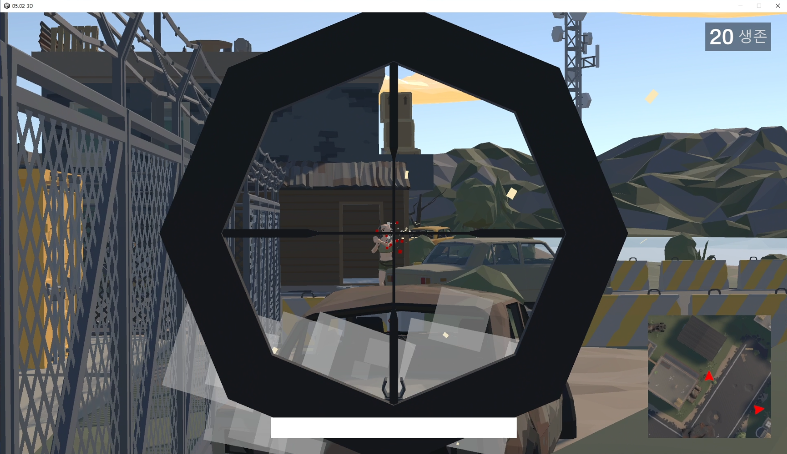

<h1>Polygon Battle Royale</h1>
Mirror 네트워크 라이브러리를 활용한 멀티플레이어 배틀 로얄 게임입니다. 
여러 플레이어가 동시에 참여하여 전투를 벌입니다.

## 스크린샷

|  |  |
|:---:|:---:|
| 방 생성 화면 | 전투 화면 |

## 개요
- **개발 기간:** 2024.05.03 ~ 2024.05.07
- **프로젝트 유형:** 팀 프로젝트(팀장: 윤성욱, 팀원: 송인석, 김민석, 석은주)

## 주요 기능
- **멀티플레이어 네트워크**: 여러 플레이어가 동시에 참여하여 실시간 동기화된 전투 진행.
- **적 AI**: 플레이어를 추적하고 공격하는 적 AI 구현.
- **자기장 시스템**: 안전 구역 밖에서 지속적인 피해를 입는 자기장 시스템 구현.
